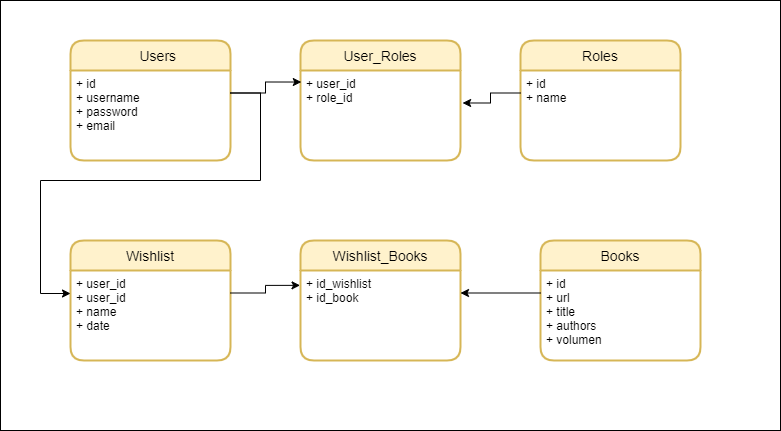
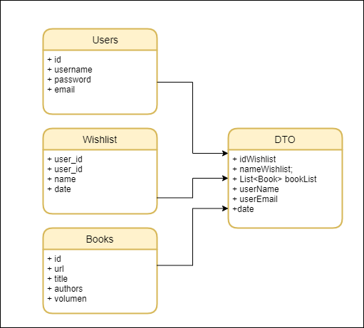
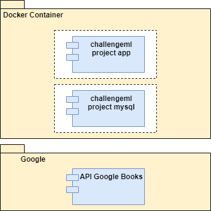

# Challege Mercado Libre
El presente ilustra el **diseño de la solución** y los pasos requeridos para poder correr la solución.

## Diseño de la Solución:
Se crea un ecosistemas de **APIs** con **Spring Boot** siguiendo un modelo en capas y patrón DTO, haciendo uso de una base de datos **MySQL**. La solución se habilita para que pueda ser deplegada dentro de un contenedor **Docker**.

**Diagrama Entidad Relación**
A continuación se ilustra el diagrama de entidad relación que define el modelo de datos de la solucuión:

Se definen las tablas User, Roles para la gestión de los usuarios de la aplicación y en donde se almacena de forma segura las credenciales de autenticación. El resto de tablas soportan la solución del challenge.

**Diagrama de Clases Alto Nivel**
El siguiente diagrama ilustra los packages y clases definidas para dar solución al reto:

**Patrón DTO:**
El uso del patrón DTO permite optimizar el esfuerzo de desarrollo para ofrecer APIs que encierren a las entidades Wishlist, Books, User en un mismo servicio.

**Diagrama de Compoentes Alto Nivel:**
Por medio de este diagrama es posible ver el encapsulado de los componentes que se defienen para la solución.

## Despliegue de la solución:
**1.** Cree una Carpeta en la raiz del directorio de su PC.

**2.** Copia el comando Git para clonar la solución.

**3.** Ubicarse en la carpeta creada en el paso 1, y haga Git Clone de la solución en dicha carpeta.

**4.** Abir ventana de comandos/cmd y navegar hasta la carpeta donde se alojo la solución.

**5.** Ejecute el siguiente comando `docker-compose up -d`  y espere hasta que finalice la creación.

> Creating challenge-ml-project_mysqldb_1 ... done

> Creating challenge-ml-project_app_1     ... done

**6.** Pruebe la creación de la base de datos y las tablas con un cliente como **MySQL Workbench 8.0 CE**. Ejecute los siguientes insert para poblar los roles que soportara la aplicación ():

`INSERT INTO testdb.roles(name) VALUES('ROLE_USER');`

`INSERT INTO testdb.roles(name) VALUES('ROLE_MODERATOR');`

`INSERT INTO testdb.roles(name) VALUES('ROLE_ADMIN');`

**7.** El siguiente paso es darse de alta como usuario a traves del api:

POST *http://localhost:8080/api/v1/auth/signup*

{
    "username": "leoh",
    "password": "789456",
    "email": "leoh@gmail.com"
}

**8.** A continuación inicie sesión a traves del api:

POST *http://localhost:8088/api/v1/auth/signin*

{
    "username": "leoh",
    "password": "789456"
}

** Recibira como respuesta el accessToken de tipo Bearer para que pueda hacer uso del resto de APIs de la solución **

**9.** El siguiente paso sería hacer una busqueda de libros de Google a traves del api:

GET *http://localhost:8088/api/v1/google/books?key_word=palabraclavebusqueda*

> No olvides configurar el Token Bearer

Obtendra un listado de libros de acuerdo al parametro ingresado en key_word.

**10.** A continuación puede almacenar en el sistema todos los libros que desee a traves del api:

POST *http://localhost:8088/api/v1/books*

{
        "url": "https://www.googleapis.com/books/v1/volumes/DN7aDwAAQBAJ",
        "title": "Bitcoin Mining 101",
        "volumen": "DN7aDwAAQBAJ",
        "authors": "Sebastian Merz"
}

> No olvides configurar el Token Bearer

**11.** Una vez registrados los libros en el sistema estos pueden ser consultados a traves de la siguiente API por volumen o por author:

GET *http://localhost:8088/api/v1/books/{volumen}?author=nombreAutor*

> No olvides configurar el Token Bearer

**12.** Para gestionar las listas de deseos (Wishlist) se disponibilizan las siguientes APIs:

####Crear Wishlist####

POST *http://localhost:8088/api/v1/wishlist*

{
    "userName": "leoh",
    "userEmail": "leoh@gmail.com",
    "date": "2022-02-22",
	"nameWishlist": "Mi Wishlist numero 10",
    "bookList": [        
        {
            "id": 10
        },
        {
            "id": 11
        }
    ]
}

> No olvides configurar el Token Bearer

####Consultar Wishlist por Id y Usuario####

Una Wishlist puede ser consultada por id y usuario

GET *http://localhost:8088/api/v1/wishlist/{idWishlist}/{username}*

> No olvides configurar el Token Bearer

####Consultar Todas las Wishlist de un Usuario dado####

GET *http://localhost:8088/api/v1/wishlist/{username}*

> No olvides configurar el Token Bearer

####Eliminar una Wishlist####

DELETE *http://localhost:8088/api/v1/wishlist/{idWishlist}*

> No olvides configurar el Token Bearer

####Consultar Todas las Wishlist####

GET *http://localhost:8088/api/v1/wishlist*

> No olvides configurar el Token Bearer